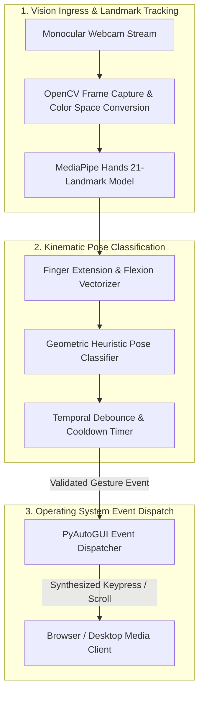

# Gesture-Controlled Reels Interface — Touchless Computer Vision Interaction Engine

[](https://www.python.org/)
[](https://opencv.org/)
[](https://developers.google.com/mediapipe)
[](https://pyautogui.readthedocs.io/)
[](LICENSE)

Repository: [https://github.com/DEEPAK21072005/Gesture-Controlled-Reels-Interface](https://github.com/DEEPAK21072005/Gesture-Controlled-Reels-Interface)

---

## 1. Executive Overview & Problem Statement

Short-form video platforms (Instagram Reels, YouTube Shorts, TikTok) rely on continuous manual swiping and tapping, creating interaction friction in hands-busy contexts (e.g., cooking, exercising, or assistive accessibility scenarios).

**Gesture-Controlled Reels Interface** is a touchless human-computer interaction (HCI) bridge that translates real-time hand gestures captured via standard webcams into native operating system input events. Utilizing **Google MediaPipe** and **OpenCV**, the system classifies hand poses into deterministic commands (Scroll Down, Scroll Up, Like, and Pause) and dispatches debounced system events via **PyAutoGUI**, eliminating the need for physical contact with peripheral devices.

---

## 2. System Architecture & Event Dispatch Pipeline



### Gesture-to-Action Mapping Matrix

| Detected Gesture | Kinematic Invariant | Dispatched OS Event | Target Media Action |
| :--- | :--- | :--- | :--- |
| **Open Palm** | All 5 finger tips extended above respective PIP joints | `pyautogui.press('down')` | Scroll to next video / reel |
| **Closed Fist** | All 4 finger tips flexed below respective PIP joints | `pyautogui.press('up')` | Scroll to previous video |
| **Thumbs Up** | Thumb extended upward ($\Delta y > \tau$), other fingers flexed | `pyautogui.press('l')` or double-click | Like video / post |
| **Horizontal Swipe** | Rapid lateral centroid velocity ($\Delta x / \Delta t > V_{\text{thresh}}$) | `pyautogui.press('right')` / `'left'` | Navigate stories or multi-panel media |

---

## 3. Core Technical Specifications

### 3.1. Debounce & False-Positive Mitigation
- **Temporal Cooldown Gate**: Dispatched actions enforce an adjustable refractory period ($t_{\text{cooldown}} = 650\text{ms}$) to prevent continuous re-triggering during static pose maintenance.
- **Centroid Hysteresis**: Lateral swipe detection requires minimum displacement exceeding $15\%$ of frame width within a 300ms sliding window.

### 3.2. Performance Optimization
- Frame resolution downscaled to $640 \times 480$ for landmark tracking, maintaining inference speeds $> 35\text{ FPS}$ on multi-core CPUs.
- Zero external dependencies beyond standard scientific Python packages.

---

## 4. Technology Stack

| Layer | Technology | Purpose |
| :--- | :--- | :--- |
| **Language** | Python 3.10+ | Runtime environment |
| **Computer Vision** | OpenCV 4.8+ | Frame capture, image transformations, HUD telemetry |
| **Pose Estimation** | MediaPipe | Real-time 3D hand landmark localization |
| **OS Automation** | PyAutoGUI | Cross-platform keyboard and mouse event dispatching |

---

## 5. Local Setup & Execution Guide

### Prerequisites
- Python `3.10` or higher
- Standard monocular webcam

### Installation

```bash
# Clone the repository
git clone https://github.com/DEEPAK21072005/Gesture-Controlled-Reels-Interface.git
cd Gesture-Controlled-Reels-Interface

# Create and activate virtual environment
python -m venv venv
# Windows:
.\venv\Scripts\activate
# macOS/Linux:
source venv/bin/activate

# Install dependencies
pip install -r requirements.txt

# Run the interface
python main.py
```

1. Open your browser to Instagram Reels or YouTube Shorts.
2. Position your webcam to capture your hand within the center third of the frame.
3. Use the gesture matrix described above to navigate hands-free. Press `q` in the terminal to exit.

---

## 6. License & Author

- **Author**: POLISETTI M N V SAI DEEPAK ([DEEPAK21072005](https://github.com/DEEPAK21072005))
- **License**: MIT License. See [LICENSE](LICENSE) for details.
